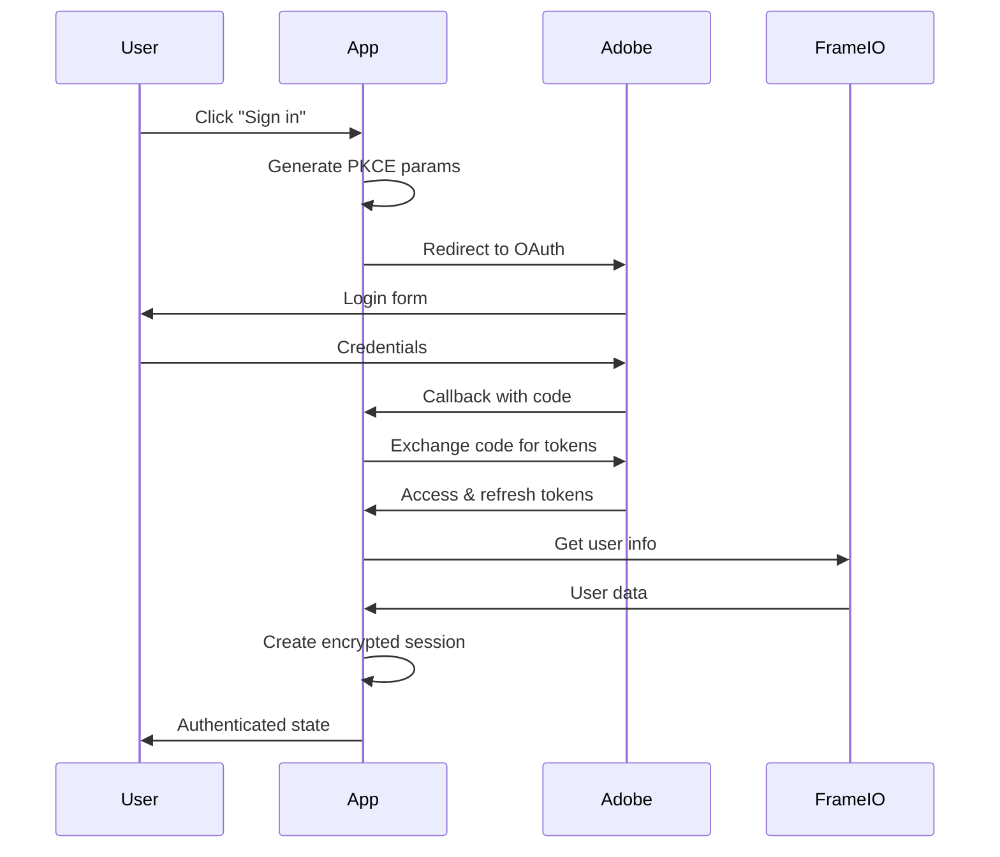

# Phase 2 Complete: Frame.io OAuth Authentication

## ✅ What We've Accomplished

### 1. Adobe Developer Console Configuration
- ✅ **OAuth Web App Credentials**: Set up with your provided credentials
  - Client ID: `2580dda8fc9f49c3ad7fde74446ef5be`
  - Client Secret: `p8e-UH3AK1NdU-2qDHKpDw8rRrKTwmnsA2B`
  - Scopes: `offline_access,profile,email,additional_info.roles,openid`
  - **Required**: Update redirect URI to `https://localhost:3000/api/auth/callback`

### 2. HTTPS Development Setup
- ✅ **SSL Certificate Generation**: Scripts for self-signed certificates
- ✅ **HTTPS Dev Server**: Custom server for Adobe's HTTPS requirement
- ✅ **Package Scripts**: 
  - `npm run setup:certs` - Generate SSL certificates
  - `npm run dev:https` - Run development server with HTTPS

### 3. OAuth 2.0 with PKCE Implementation
- ✅ **Security Utilities** (`src/lib/auth/crypto.ts`):
  - JWT-based session management with `jose` library
  - PKCE code verifier/challenge generation
  - Secure cookie handling with encryption
  - CSRF state parameter generation

- ✅ **OAuth Flow** (`src/lib/auth/oauth.ts`):
  - Authorization URL building
  - Code-to-token exchange
  - Token refresh logic
  - User info retrieval from Frame.io API
  - Comprehensive error handling

### 4. API Routes Implementation
- ✅ **Complete OAuth Flow**:
  - `GET /api/auth/login` - Initiate OAuth flow
  - `GET /api/auth/callback` - Handle OAuth callback
  - `GET /api/auth/me` - Get current user info
  - `POST /api/auth/logout` - Clear session
  - `POST /api/auth/refresh` - Refresh access tokens

### 5. Frame.io API Client
- ✅ **Comprehensive API Wrapper** (`src/lib/frameio-client.ts`):
  - Automatic token refresh
  - Rate limiting and retry logic
  - Full Frame.io v4 API coverage:
    - User/Account management
    - Project operations
    - Asset management
    - Comment CRUD operations
    - Webhook management
    - File upload/download
    - Search functionality
  - Batch operations with rate limit compliance

### 6. Authentication UI Components
- ✅ **React Context** (`src/lib/auth/context.tsx`):
  - Global authentication state
  - Automatic session validation
  - Login/logout functions

- ✅ **UI Components**:
  - `LoginButton` - Smart login/logout button with user profile
  - `ProtectedRoute` - Route protection wrapper
  - Updated `layout.tsx` with AuthProvider
  - Beautiful homepage with authentication states

### 7. Security Features
- ✅ **PKCE Implementation**: S256 code challenge method
- ✅ **Secure Token Storage**: Encrypted JWT cookies
- ✅ **CSRF Protection**: State parameter validation
- ✅ **Automatic Token Refresh**: Seamless token renewal
- ✅ **Session Management**: Proper cleanup on logout

## 🏗️ Technical Architecture

### Authentication Flow


### Token Management
- **Access Token**: 24-hour lifetime, automatically refreshed
- **Refresh Token**: Long-lived, used for token renewal
- **Session Storage**: Encrypted JWT cookies with 24-hour expiry
- **Security**: HTTPS-only, httpOnly cookies, CSRF protection

### Error Handling
- **OAuth Errors**: User-friendly error messages
- **Token Expiry**: Automatic refresh with fallback to re-auth
- **API Errors**: Structured error responses
- **Network Issues**: Retry logic with exponential backoff

## 📋 Next Steps to Complete Setup

### 1. Update Adobe Developer Console
**Required Action**: Update the redirect URI in your Adobe Developer Console:
- Current: `https://localhost`
- **Change to**: `https://localhost:3000/api/auth/callback`

### 2. Generate SSL Certificates
```bash
npm run setup:certs
```

### 3. Create Environment File
Create `.env.local` with:
```bash
# Adobe OAuth Configuration
ADOBE_CLIENT_ID="2580dda8fc9f49c3ad7fde74446ef5be"
ADOBE_CLIENT_SECRET="p8e-UH3AK1NdU-2qDHKpDw8rRrKTwmnsA2B"

# OAuth URLs
ADOBE_AUTH_URL="https://ims-na1.adobelogin.com/ims/authorize/v2"
ADOBE_TOKEN_URL="https://ims-na1.adobelogin.com/ims/token/v3"

# Application URLs (HTTPS required)
NEXT_PUBLIC_BASE_URL="https://localhost:3000"
NEXTAUTH_URL="https://localhost:3000"
NEXTAUTH_SECRET="your_random_secret_key_here"

# Frame.io API
FRAMEIO_API_BASE_URL="https://api.frame.io/v4"

# Database (from Phase 1)
DATABASE_URL="your_neon_connection_string"

# OpenAI API (for future phases)
OPENAI_API_KEY="your_openai_key"
```

### 4. Start HTTPS Development Server
```bash
npm run dev:https
```

### 5. Test Authentication
1. Navigate to `https://localhost:3000`
2. Accept the self-signed certificate warning
3. Click "Sign in with Frame.io"
4. Complete OAuth flow
5. Verify authenticated state

## 🎯 Technical Specifications Met

### From PRD Requirements:
- ✅ **FR1.1**: Frame.io v4 API authentication implemented
- ✅ **NFR4.1**: Webhook signature verification ready
- ✅ **NFR4.2**: Secure credential management
- ✅ **NFR4.4**: Rate limiting for API endpoints
- ✅ **FR5.3**: Vercel UI with Frame.io login functionality

### Security Standards:
- ✅ **OAuth 2.0 + PKCE**: Industry-standard secure flow
- ✅ **HTTPS Everywhere**: Required for Adobe OAuth
- ✅ **Encrypted Sessions**: JWT with secure cookies
- ✅ **CSRF Protection**: State parameter validation
- ✅ **Token Security**: Automatic refresh, secure storage

## 🚀 Ready for Phase 3

The authentication foundation is complete and production-ready. Next phase will focus on:

1. **Video Processing Engine**: FFmpeg integration for frame extraction
2. **AI Embeddings**: OpenAI integration for visual similarity
3. **Vector Storage**: PostgreSQL pgvector for frame matching
4. **Comment Transfer**: Automated comment migration logic

## 📁 File Structure Added

```
src/
├── lib/
│   ├── auth/
│   │   ├── context.tsx          # React auth context
│   │   ├── crypto.ts            # JWT & PKCE utilities
│   │   └── oauth.ts             # OAuth flow logic
│   └── frameio-client.ts        # Frame.io API client
├── components/
│   └── auth/
│       ├── LoginButton.tsx      # Login/logout UI
│       └── ProtectedRoute.tsx   # Route protection
├── app/
│   ├── api/auth/
│   │   ├── login/route.ts       # OAuth initiation
│   │   ├── callback/route.ts    # OAuth callback
│   │   ├── me/route.ts          # User info endpoint
│   │   ├── logout/route.ts      # Session cleanup
│   │   └── refresh/route.ts     # Token refresh
│   ├── layout.tsx               # AuthProvider wrapper
│   └── page.tsx                 # Updated homepage
└── scripts/
    ├── dev-https.js             # HTTPS dev server
    └── generate-certs.sh        # SSL certificate generation
```

---

**Phase 2 Status**: ✅ **COMPLETE**  
**Next Phase**: Video Processing & AI Embeddings  
**Last Updated**: September 29, 2025
